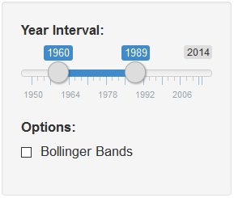
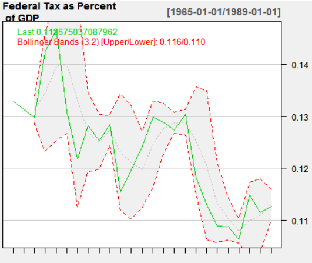

US GDP and Tax Analysis
========================================================
author: nsen39
date: 9/21/2016
autosize: true

Coursera Data Products Project

Application
========================================================

Applicatin allows the user to examine
 
- Examine Tax Collections as a percentage of GDP
- Turn on and Turn off Bollinger Bands
- Visually Examine the data for different time intervals

Data
========================================================

Three data sets were used. 
The data sets were obtained from St. Louis Federal Reserve FRED data base
- US GDP: https://fred.stlouisfed.org/series/GDP
- Federal Government Current Tax Receipts: https://fred.stlouisfed.org/series/W006RC1A027NBEA


```
      GDP          TaxCollections   TaxPercentofGDP  
 Min.   :  243.1   Min.   :  32.8   Min.   :0.08142  
 1st Qu.:  671.1   1st Qu.:  88.6   1st Qu.:0.11073  
 Median : 3131.8   Median : 387.0   Median :0.12328  
 Mean   : 5292.4   Mean   : 590.1   Mean   :0.12405  
 3rd Qu.: 8889.7   3rd Qu.:1075.5   3rd Qu.:0.13792  
 Max.   :17783.6   Max.   :2149.2   Max.   :0.16706  
```

Time Interval Analysis
========================================================
Change various time intervals to zoom into time series of interest.



Options
========================================================
Option to Add Bollinger Bands to examine if the trends are breaking out of the standard deviation bands.



