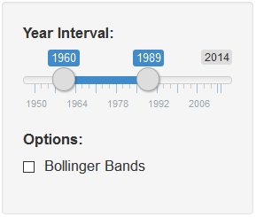

```{r setup, include=FALSE}
knitr::opts_chunk$set(echo = TRUE)
```

## Overview

Applicatin allows the user to:
 
- Examine Tax Collections as a percentage of GDP
- Turn on and Turn off Bollinger Bands
- Visually Examine the data for different time intervals

### Time Interval
  
By moving the slider inputs user can focus in on the time interval for closer analysis.


### Bollinger Bands


  
By checking and unchecking the check box the user has the ability to apply Bollinger Bands to the vizual analysis.
For detailed information about Bollinger Bands please click the link to Wikipedia page: 
[Bollinger Bands Wikipedia](https://en.wikipedia.org/wiki/Bollinger_Bands)
  

### Data

Data source for the application can be obtained using the following code in R:

```{r datasource, eval=FALSE}
#### Download FRED data ####
if(!require(quantmod)) install.packages("quantmod")
require(quantmod)

# set tickers
tickers <- c("GDP", "W006RC1A027NBEA")

# import data from FRED database
getSymbols( tickers
            , src = "FRED"
            , adjust = TRUE
)

#Create Data Set
dtGDPtax <- data.table(Date = index(merge.xts(GDP, W006RC1A027NBEA, join = "inner")), merge.xts(GDP, W006RC1A027NBEA, join = "inner"))
names(dtGDPtax)[3] <- "TaxCollections"
dtGDPtax.percent <- dtGDPtax[,TaxPercentofGDP:=TaxCollections/(GDP)]
rownames(dtGDPtax.percent) = dtGDPtax.percent[,Date]
xtsGDPtax.percent <- as.xts(dtGDPtax.percent)

save(xtsGDPtax.percent, file = "GDPtaxpercent.RData")

#=====================
# Notes:
#=====================
#
# Source: US. Bureau of Economic Analysis   Release: Gross Domestic Product  
# BEA Account Code: A191RC1
# 
# Gross domestic product (GDP), the featured measure of U.S. output, is the market value of the goods and services produced by labor and property located in the United States.
# 
# For more information, see the Guide to the National Income and Product Accounts of the United States (NIPA) - (http://www.bea.gov/national/pdf/nipaguid.pdf)
# 
# Suggested Citation:
# US. Bureau of Economic Analysis, Gross Domestic Product [GDP], retrieved from FRED, Federal Reserve Bank of St. Louis; https://fred.stlouisfed.org/series/GDP, August 27, 2016.
#
#
# Source: US. Bureau of Economic Analysis   Release: Gross Domestic Product  
# BEA Account Code: W006RC1
# 
# For more information about this series, please see http://www.bea.gov/national/.
# 
# Suggested Citation:
# US. Bureau of Economic Analysis, Federal government current tax receipts [W006RC1A027NBEA], retrieved from FRED, Federal Reserve Bank of St. Louis; https://fred.stlouisfed.org/series/W006RC1A027NBEA, September 24, 2016.

```
